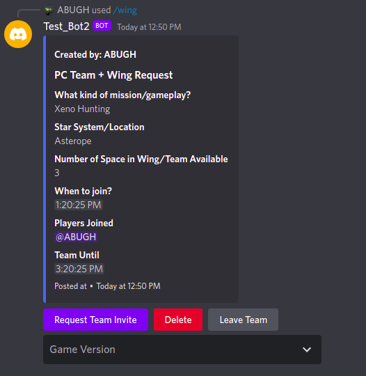
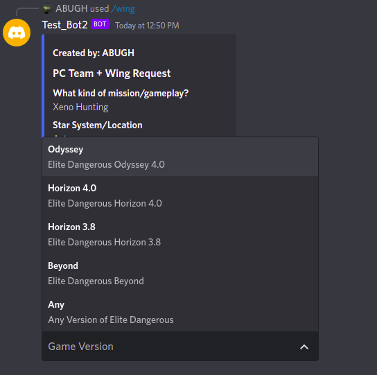
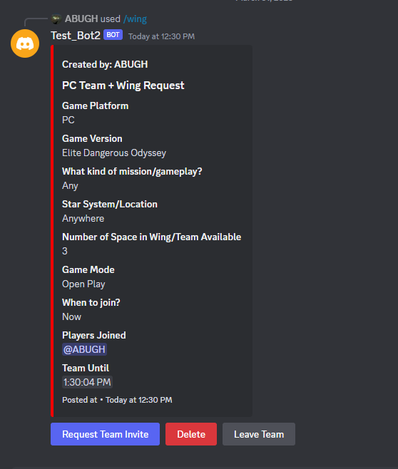

# Looking For Team invite discord bot.

**Specifically Designed for Elite Dangerous Community.**


## Table of Contents

- [Features](#features)
- [Technology Used](#technologies)
- [Configuration](#configure)
- [Build](#configure)
- [Screenshots](#screenshots)
- [Dependencies on Websites for data](#dependencies-on-websites)
- [Configure it for different Game](#configure-it-for-different-game)

## Technologies

This project is created with:

- [Node](https://nodejs.org)
- [TypeScript](https://www.typescriptlang.org/)
- [Discordjs](https://discord.js.org/)
- [Quickchart](https://quickchart.io/)
- [Sqlite](https://www.sqlite.org/)

## Dependencies on Websites

- Current Faction Info: [EDSM](https://www.edsm.net/)
- System Faction History: [EDSM](https://www.edsm.net/) and [QuickChart](https://quickchart.io/)
- System Traffic: [EDSM](https://www.edsm.net/)
- System Death: [EDSM](https://www.edsm.net/)
- Last Tick Info: [ELITE BGS](https://elitebgs.app/bgsbot/)

## Screenshots

<details>
  <summary>Show</summary>

### Screenshot of Team Creations

1. Creating new Team:<br>
   
2. Initial Team Created:<br>
   
3. Select Game Version:<br>
   
4. Final Team Creation Message:<br>
   

### Screenshot of Team Request

1. Request Team invite:<br>
   
2. Team Request Accepted:<br>
   

### Screenshot of Other Features

1. System Faction History:<br>
   
2. System Traffic:<br>
   
3. System Death Info:<br>

</details>

## Configure

- Make Sure you have [Node 18+ Installed](https://nodejs.org/en/download/)
- [Create a Discord bot](https://discord.com/developers/applications)
- Goto Bot in Discord Developer Portal->settings

  - Give your Bot a nice name and Picture
  - Reset Token, Enter 2FA code (if you have any)
  - Copy the Token and set your evironment variable.
    - In Windows
      - Search for `Edit the system enviroment variables`
      - Select the result it would take you to System Properties.
      - Click on Environment Variables
      - Under Uservariables for "Your Username"-> Click New.
      - Variable Name: `LOOKING_FOR_TEAM_BOT_TOKEN` && Variable Value: `Your Bot Token`
      - Select OK -> OK -> OK, Restart your Terminal, CMD or IDE.
    - In Linux
      - Open your Terminal and use the command
        ```bash
        export LOOKING_FOR_TEAM_BOT_TOKEN=your_token_here
        ```
      - To make it persist add it to User's Profile
      - In Terminal
        ```bash
        nano ~/.bash_profile
        ```
      - Add the following at the end of the file
        ```bash
        export LOOKING_FOR_TEAM_BOT_TOKEN=your_token_here
        ```

- Select your bot on Discord Developer Portal->OAuth2->URL Generator
  - In scope
    - Select `bot`.
  - In Bot Permission
    - `Read Messages`
    - `Send Messages`
    - `Manage Messages`
    - `Use Slash Commands`
- Copy Generated Url and open it on a web browser and select Server.

**Channel Specific Configuration**

- Change the Channel IDs `[Platform]_CHANNEL_ID` in [AppSetting](./utils/settings.ts)

## Build

- Using NPM
  ```bash
  npm install
  ```
  ```bash
  npm run build
  ```
- Docker
  ```bash
    docker build .
  ```

## Run dev mode

- Start using NPM
  ```bash
  npm start
  ```
- Manually
  ```bash
  ts-node index.ts
  ```

## Run production mode

- using Node
  ```bash
  node dist/index.js
  ```
- using Docker
  ```bash
  docker-compose up
  ```

# Features

- Create/Delete Team.
- Accept/Reject/Cancel Team Invite.
- Auto Message Delete when team expires.
- System Faction History, Traffic and Death.

_Checkout the [Screenshots](#screenshots) section._

# Features in Progress

- Unit Testing.
- Adding Sqlite for caching the API result.
- Adding channel id for replies.

# Future Plans

- Adding more features like Exploration and Mining.
- Make it available for other game without editing configuration

# Contribution

Before contributing, please read the [common contributors guide](https://opensource.guide/) for useful information.

- If you have anything to ask, raise a issue.
- Feel like something is missing raise an issue.
- If you feel like you can help me with code, have a look at the issues section.

# Configure it for Different Game.

Change the values in [AppSetting](./utils/settings.ts)

- `GAME_NAME`: Your Game Name
- `DEFAULT_GAME_VERSION`: Your game Version.
  _if you have only one version across Console and PC platform then leave `PC_CHANNEL_ID` empty_
- `AVAILABLE_GAME_VERSIONS`: In case of Multiple game version.
- `BOT_HELP_COMMAND_REPLY_FIELD_VALUES`: Change it according to your game.

  **Optional**
- `BOT_WING_COMMAND_NAME`: Change the team invite command.
- Change the titles of respective channel and their channel Names.
- Comment out the API URLs if you don't need them or exclude the commands from discord server.

# Info

_EDSM, ELITE BGS and QuickChart are copyright of their respective owners_

_Elite Dangerous © 1984 - 2022 Frontier Developments Plc_
